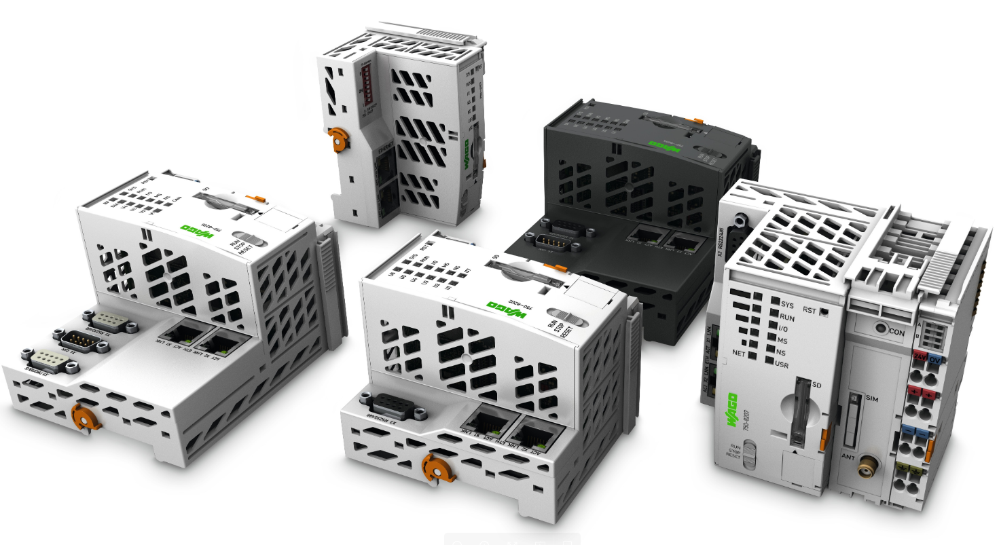

# How to install:
WAGO recommends exclusive use of original WAGO SD cards, as the new firmware has been tested and released based on these cards. If using cards other than WAGO, WAGO cannot guarantee and take responsibility for proper functioning of the controller/coupler.

## Installation

1. Delete full content of the card with tools like "DiskPart" or any other, google is your friend:)
2. Write <a href="https://github.com/WAGO/pfc-firmware/releases" title="image">image</a> on the WAGO SD card with "Win32DiskImager" - to download click here: https://sourceforge.net/projects/win32diskimager/
3. Plug-in the WAGO SD card first before booting the PFC100/200.
4. Connect the Wago Servicecable between PC and PFC100/200. This is needed since a factory-image PLC is set to use DHCP and therefor has no fixed IP address.
5. Adjust the static IP address with "Wago Ethernet Settings".
6. Due to changes in the WebBasedManagement (WBM), make sure to delete the full browser cache (!) and restart the browser after.
7. Open "WebBasedManagement / Administrations – Menue / Create Image // Create bootable image from active partition (SD) // Start Copy".
8. WAGO Ethernet settings is at least required in version 6.8.2.2. To download this version, click following link: https://wago.sharefile.eu/d-s6d218ea736c4918a
